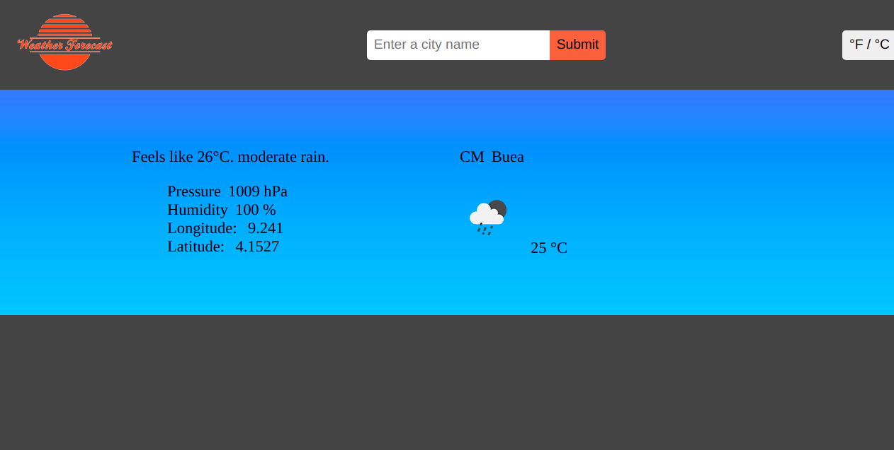

# Weather App

A simple weather app, that is able to:

- Take a city name and display the weather of that city
- If the city doest exist, throws a notice to the user
- Change images and background in based on the weather

## Built With

- JavaScript
- HTML
- CSS
- Webpack

## [Live](https://awesome-davinci-796587.netlify.app/)

## Getting Started

To set up a local copy of the project

- `git clone https://github.com/wandji20/weather-app/`
- `cd weather-app`
- `npm install`

## Run locally

- Now you are ready to run a local server
- Go to your command line and put `npm start`
- Go to https://localhost:8080/
- Try it!!

## Author

👤 **Wandji Bertrand**

- Github: [@wandji20](https://github.com/wandji20)
- Twitter: [@wandjibertrand](https://twitter.com/wandjibertrand)
- Linkedin: [Linkedin](https://www.linkedin.com/in/wandji-bertrand/)

## Acknowledgements

- Microverse
- The Odin Project
- [openweathermap](https://openweathermap.org/)

## 🤝 Contributing

Contributions, issues, and feature requests are welcome!

## Show your support

Give a ⭐️ if you like this project!

## 📝 License

Copyright 2021 Wandji Bertrand

Permission is hereby granted, free of charge, to any person obtaining a copy of this software and associated documentation files (the "Software"), to deal in the Software without restriction, including without limitation the rights to use, copy, modify, merge, publish, distribute, sublicense, and/or sell copies of the Software, and to permit persons to whom the Software is furnished to do so, subject to the following conditions:

The above copyright notice and this permission notice shall be included in all copies or substantial portions of the Software.

THE SOFTWARE IS PROVIDED "AS IS", WITHOUT WARRANTY OF ANY KIND, EXPRESS OR IMPLIED, INCLUDING BUT NOT LIMITED TO THE WARRANTIES OF MERCHANTABILITY, FITNESS FOR A PARTICULAR PURPOSE AND NONINFRINGEMENT. IN NO EVENT SHALL THE AUTHORS OR COPYRIGHT HOLDERS BE LIABLE FOR ANY CLAIM, DAMAGES OR OTHER LIABILITY, WHETHER IN AN ACTION OF CONTRACT, TORT OR OTHERWISE, ARISING FROM, OUT OF OR IN CONNECTION WITH THE SOFTWARE OR THE USE OR OTHER DEALINGS IN THE SOFTWARE.
